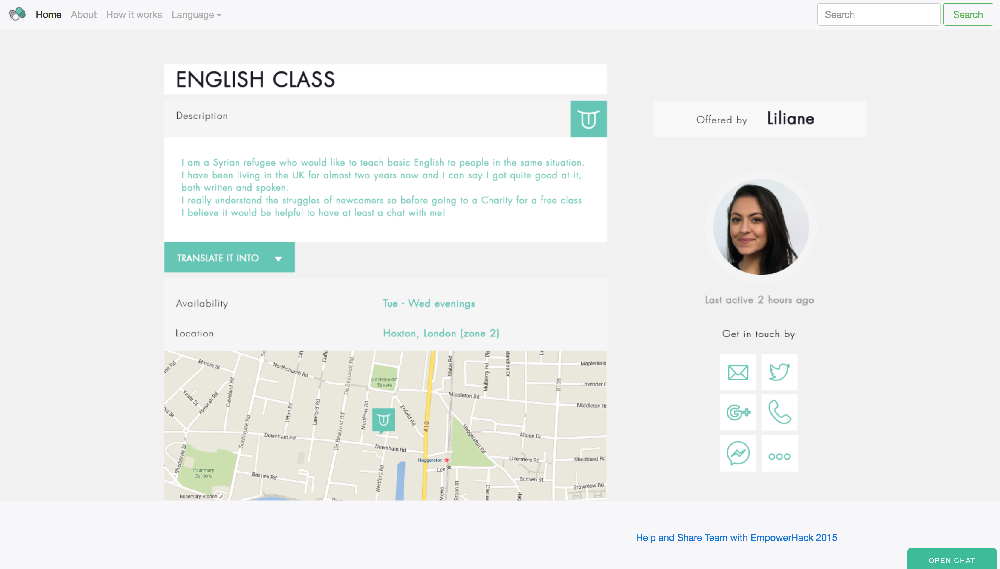

# HelpAndShare

Help and Share Community

Visit the site now ... [Help And Share App](http://empowerhack.github.io/HelpAndShare/)

2015 EmpowerHack Hackathon lightening presentation: https://youtu.be/TkIVEyM40jk

2015 EmpowerHack Hackathon final presentation: https://www.youtube.com/watch?v=-YBp0hfACjA 

## Contributing

You can contribute in many areas:

* Testing - use the App, share the App and give us your feedback by logging ideas / bugs etc in the [Issue section](https://github.com/empowerhack/HelpAndShare/issues)
* Feature suggestions - log in the [Issue section](https://github.com/empowerhack/HelpAndShare/issues)
* Coding - look in the issue section and create a PR...you know what I mean!
* Documentation - this is always a lacking area, feel free to add or improve existing text
* Wireframes / User Journeys / Story boards - discuss ideas and making the road map clear

## Screenshot

Note this is **out-of-date** view the [latest deployed demo](http://empowerhack.github.io/HelpAndShare/) 

